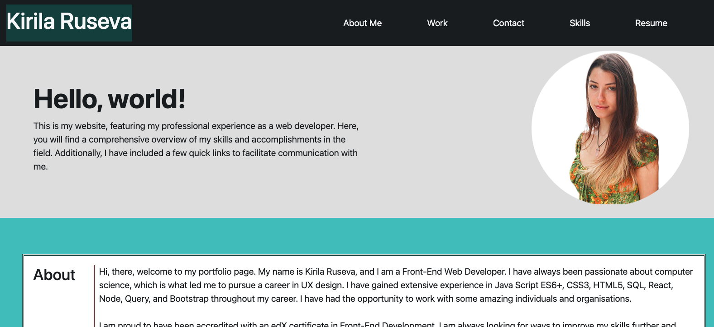

# Bootstrap-Portfolio

## Description

A portfolio website showcasing a person's work through an about section, contact details, skills section and examples of their work.

Link to the deployed project:
https://unicorn453.github.io/Bootstrap-Portfolio/

## Installation

N/A

## Usage

The website was built using the Bootstrap library and its styling attributes. However, I added some original styling in the CSS folder to make the design more unique. For instance, I used a media rule to adjust the background photo in the jumbotron section to display correctly on all device widths. The navigation has a hamburger menu, so to see it, the device width should be no more than 980 px. When the links on the navigation are clicked, they point to the specified section of the page. In the work section of the webpage, you'll find pictures of completed projects. Clicking on them will open a new slide for review, except for the one with a placeholder image. In the contact section, you'll find links to social media channels and a link to send a direct email message.

## Credits

For the writing of this README file, I used notes taken from a previous project:
GitHub. (n.d.). portfolio-page/README.md at main · unicorn453/portfolio-page. [online] Available at: https://github.com/unicorn453/portfolio-page/blob/main/README.md [Accessed 19 Dec. 2023].
‌

## License

Please refer to the LICENSE in the repo.
